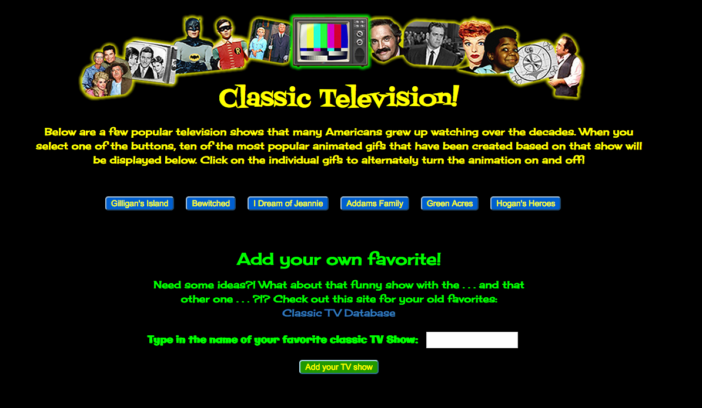
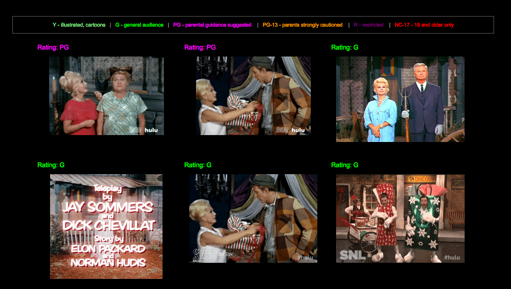

# GifTastic *(with a "Classic" Television theme)*
Published site: [https://bonnieho.github.io/GifTastic/](https://bonnieho.github.io/GifTastic/)

## Overview

This is an exercise in successfully using an API key to GET data from an external site and then - using specific attributes of the objects returned - render (as with the rating) or manipulate (as with the animate or static data state) those resulting objects (animated gifs) within the document.

In this assignment, the [GIPHY API](https://developers.giphy.com/docs/) was called and returned results were modified using Javascript and jQuery to create a dynamic web page that populates with gifs of the user's choice, based on a theme of classic television shows. Additionally, a user may toggle between animated and static versions of the same image as well as create buttons for their own favorite television shows so that they can call popular animated gifs associated with those choices.

Theme-inspired, artistic fonts are drawn from the Google Fonts library, and layout and responsive functionality was achieved through the combined implementation of html5, css3, and Bootstrap3.



- - - 


### How it works
1. The first step was to create an array of strings (based on title) to populate the initial buttons used to call specific classic television shows.

2. A button element for each array member is created using jQuery syntax with titles applied as a class. Through the use of a loop, those buttons are appended to a specifically styled display div on the result page.

3. When the user clicks on a button, a function call grabs 10 static, non-animated gif images accessed from the Giphy API and places them on the page in a unique div.

4. The GET request to the Giphy API used to obtain these gifs uses parameters for the initial query and a desired amount to return (limit) and was rendered as a variable as such:

`queryURL = "https://api.giphy.com/v1/gifs/search?q=" + searchShows + "&limit=10" + "&api_key=dc6zaTOxFJmzC";`

_(A public API key for developers' use is provided by Giphy and sent with the query request.)_

The call is ultimately sent on a button click as such:

    ...
    	$.ajax({url: queryURL, method: 'GET'})
    ...

5. Since the object returned by the Giphy API also contains a parameter for rating for each gif (such as PG, G, so on), these ratings are also displayed in a discrete, dynamic placeholder div directly above each returned image. As an added feature, those ratings have been color-coded through formatting using a loop and if else statements:

```
...
    	else if(response.data[i].rating==="pg"){
    		ratingColor = 'magenta';
    	}
    	else if(response.data[i].rating==="pg-13"){
    		ratingColor = 'orange';
    	}
...
```




6. The initial set of gifs returned are the *still* versions of those images, and since we want the gif to animate once the user clicks on them, a function to swap the static version to instead render one of the animated versions of each gif must be called. Likewise, once the user clicks the gif again, it should stop playing; in other words, return to the static state once more.

_(partial code example)_

    ...
    	if (state === "still") {
			$(this).attr("src", $(this).attr("data-animate"));
			$(this).attr("data-state", "animate");
    	} else {
    ...

7. Finally, a form was created within the page to allow the user to add buttons based on classic tv shows of their interest. This form takes a value from a user input text field and pushes it into the current topics array. Following the execution of that action, another function call regenerates all of the buttons on the page based on the newly updated set of tv show names (elements) in the array.

- - -

### Challenges!

Specific functionality that was not critical to the overall function of the page but still kept this programmer up at night were ultimately resolved through sheer stubbornness and lots of research and inquiry. Although most of those irritations were cosmetic, some were simply proactive concerns in anticipation of specific situations and/or hosting environments. For example:

* In order to avert any synchronization issues, all scripting is contained within a document ready function to allow scripts to run ONLY after the document is loaded completely:

_(partial code example)_

`$(document).ready(function(){ ...`

* Since we're using a form, we want to prevent that form from trying to submit itself with:

`event.preventDefault();`

* The protocol in the query URL was amended from http to https so that the app will work properly if ever deployed to Heroku or a similar hosting environment.

Cosmetically, we would like the form to start out with an empty text field instead of what was previously entered:

`$('#tv-show-input').val("");`

Also, when rending a new set of buttons based on the updated show array, it's nice to clear out the previously added buttons so as to avoid any possible duplicates:

*(within the* `renderButtons()` *function)*

`$("#buttons-view").empty();`

Likewise, we also want to empty out the div that holds the ten gifs (the static versions) previously called up once another show button is clicked:

`$('#my-ten-gifs').empty();`


- - - 


(c)2017 __Bonnie Lynne Hoffman__ 

*toward the completion of The University of Texas at Austin Houston Coding Boot Camp Certificate - (June 2017 cohort)*
